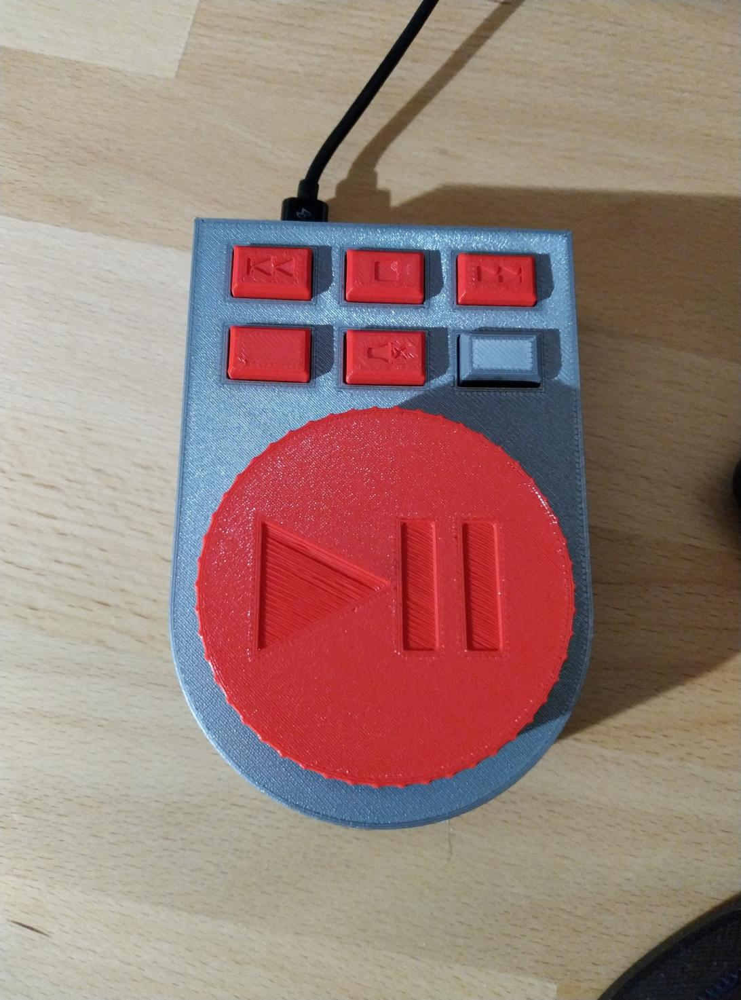

# Multimedia Keyboard

Multimedia keyboard for audio control. RPI pico emulates a multimedia HID keyboard

# Functionality
- Volume up/down
- pause/play
- next track
- previous track
- stop track
- google meet mic mute
- microsoft teams mic mute

# For HW we need 
- RPI pico
- 6x switch 6x6mm 7mm [link](https://www.aliexpress.com/item/1005002076550064.html?spm=a2g0o.productlist.0.0.2fb64ad74JB1mU&algo_pvid=0163f4f0-5ff1-4e94-891d-a1edc95a7f85&aem_p4p_detail=202205060114555189892433286990001252763&algo_exp_id=0163f4f0-5ff1-4e94-891d-a1edc95a7f85-3&pdp_ext_f=%7B%22sku_id%22%3A%2212000018656397845%22%7D&pdp_npi=1%40dis%7CEUR%7C%7C0.76%7C%7C%7C1.6%7C%7C%40210318be16518248956714345eac0a%7C12000018656397845%7Csea)
- rotary encoder module [link](https://www.aliexpress.com/item/32631275788.html?spm=a2g0o.order_list.0.0.47bd1802xBjui3)
- wires
- screw M4
- nut M4 [link](https://www.aliexpress.com/item/1005002361713083.html?spm=a2g0o.order_list.0.0.47bd1802xBjui3)
- feet [link](https://www.aliexpress.com/item/33041571060.html?spm=a2g0o.productlist.0.0.758f3135ko0wHO&algo_pvid=76702fe5-d5af-47b8-a994-617759d4d001&aem_p4p_detail=202205060115467407324789163200001235732&algo_exp_id=76702fe5-d5af-47b8-a994-617759d4d001-2&pdp_ext_f=%7B%22sku_id%22%3A%2267341453366%22%7D&pdp_npi=1%40dis%7CEUR%7C%7C0.69%7C%7C%7C%7C%7C%40210318d116518249468761773e0f90%7C67341453366%7Csea)
- micro USB cable

# HW connecting
Switches on the keyboard use one common ground wire. On the botton side is hole, for switch RPI pico to "flash mode" without case opening. As MCU is used RPI pico. Currently is RPI pico cheaper as Arduino Micro

Pico pinout:
Encoder DT - 20
Encoder CLK - 21
Encoder SW - 19

Switch prew - 6
Switch stop - 5
Switch next - 3
Switch button A - 5
Switch mute - 4
Switch button C - 7

# SW
Arduino IDE is used for programming. It's neccesary install support for RPI pico board to arduino ide. Link for library is [here](https://github.com/earlephilhower/arduino-pico/releases/download/global/package_rp2040_index.json). Then as board we need use "Arduino Mbed OS RP2040 boards". Before SW flashing is neccesary hold BOOT switch, and power up RPI pico.

# Links
Link to source [code](https://github.com/johnyHV/multimediaKeyboard)

Link to 3D model on the [thingiverse](https://www.thingiverse.com/thing:5378572)
